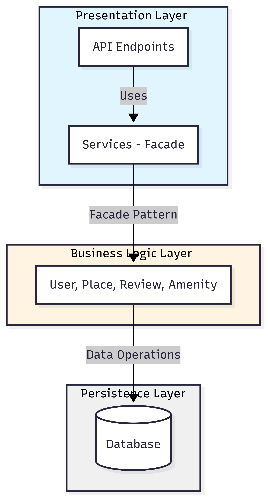

# holbertonschool-hbnb
# HBnB Technical Documentation
## Complete System Architecture and Design

---

## Table of Contents

1. [Introduction](#introduction)
2. [High-Level Architecture](#high-level-architecture)
3. [Business Logic Layer - Detailed Class Diagram](#business-logic-layer)
4. [API Interaction Flow - Sequence Diagrams](#api-interaction-flow)
5. [Design Decisions](#design-decisions)
6. [Conclusion](#conclusion)

---

## 1. Introduction {#introduction}

### 1.1 Document Purpose
This technical document serves as the complete blueprint for the **HBnB (Holberton BnB)** project, a property rental application similar to Airbnb. It provides a detailed reference for all implementation phases and offers a clear vision of the system architecture, data models, and interaction flows.

### 1.2 Project Scope
The HBnB project is a platform that allows users to:
- **Create and manage user accounts** (hosts and travelers)
- **Publish and manage property listings** for rent
- **Search and filter accommodations** based on various criteria
- **Submit and view reviews** on properties
- **Manage amenities** associated with places

### 1.3 Overall Architecture
The application follows a **layered architecture** with three distinct tiers:
1. **Presentation Layer**: Manages user interfaces (REST API, Web, Mobile)
2. **Business Logic Layer**: Business logic and data models
3. **Persistence Layer**: Data access and storage

This separation ensures **maintainability**, **scalability**, and **decoupling** between components.

---

## 2. High-Level Architecture {#high-level-architecture}

### 2.1 Package Diagram

The following diagram illustrates the three-layer architecture of the HBnB application and the communication between these layers via the Facade pattern.



**Figure 1**: High-Level Package Diagram showing the three-layer architecture

### 2.2 Layer Descriptions

#### 2.2.1 Presentation Layer
**Responsibilities:**
- Handle incoming HTTP requests (REST API)
- User interfaces (Web and Mobile)
- Routing and endpoint control
- User input validation
- Response formatting (JSON, HTML)

**Main Components:**
- **API Endpoints**: Entry points for client applications
  - User endpoints: `/api/v1/users`
  - Place endpoints: `/api/v1/places`
  - Review endpoints: `/api/v1/reviews`
  - Amenity endpoints: `/api/v1/amenities`
- **Services - Facade**: Unified interface to Business Logic Layer

**Communication Flow:**
```
Client → API Endpoints → Facade (Services) → Business Logic Layer
```

**Suggested Technologies:** 
- Flask/FastAPI (Python)
- Express.js (Node.js)

#### 2.2.2 Facade Pattern
**Role:**
The Facade pattern serves as a **unified interface** between the presentation layer and business logic layer. It acts as a central orchestration point that simplifies interactions by hiding the underlying system's complexity.

**Key Benefits:**
- ✅ **Decoupling**: Presentation layer doesn't know business logic implementation details
- ✅ **Simplicity**: Single interface for all operations
- ✅ **Maintainability**: Internal changes without impacting presentation layer
- ✅ **Reusability**: Business code reusable by different interfaces (Web, Mobile, API)

**Operation Example:**
```python
# Without Facade (tight coupling)
user = UserRepository.get(user_id)
place = PlaceRepository.add(place_data)
amenity1 = AmenityRepository.get(amenity_id1)
place.add_amenity(amenity1)

# With Facade (loose coupling)
facade.create_place(place_data)  # Handles everything internally
```

#### 2.2.3 Business Logic Layer
**Responsibilities:**
- Implementation of business rules
- Domain entity management (User, Place, Review, Amenity)
- Business data validation
- Complex operation coordination
- Entity relationships management

**Main Components:**
- **Core Models**: Entity representation (User, Place, Review, Amenity)
- **Business Rules**: Validation logic and business processes
- **Domain Services**: Cross-cutting services (authentication, calculations)

**Business Rule Examples:**
- A user cannot review their own place (user_id ≠ place.owner_id)
- Review rating must be between 1 and 5
- A place must have at least one owner
- Email addresses must be unique
- Price per night must be greater than 0

#### 2.2.4 Persistence Layer
**Responsibilities:**
- Data access and storage
- CRUD operations (Create, Read, Update, Delete)
- Transaction management
- Object-relational mapping (ORM)
- Database connection pooling
- Query optimization

**Main Components:**
- **Repositories**: Data access abstraction
  - `UserRepository`: User data operations
  - `PlaceRepository`: Place data operations
  - `ReviewRepository`: Review data operations
  - `AmenityRepository`: Amenity data operations
- **Database**: Relational database (PostgreSQL, MySQL)
- **Connection Management**: Database connection handling

**Repository Pattern Benefits:**
- Abstraction of data access logic
- Centralized query management
- Easy testing with mock repositories
- Flexibility to change database technology

**Communication Flow:**
```
Business Logic → Repository → Database
                    ↓
            SQL/ORM Queries
```

---

## 3. Business Logic Layer - Detailed Class Diagram {#business-logic-layer}

### 3.1 Complete Class Diagram

The following diagram presents the detailed class structure of the Business Logic Layer, showing all entities, their attributes, methods, and relationships.


**Figure 2**: Detailed Class Diagram for Business Logic Layer

### 3.2 Detailed Entity Descriptions

#### 3.2.1 BaseModel (Abstract Class)
**Description:** Base abstract class that provides common functionality for all entities

**Attributes:**
- `id`: UUID4 - Unique identifier
- `created_at`: DateTime - Entity creation timestamp
- `updated_at`: DateTime - Last modification timestamp

**Methods:**
- `save()`: void - Persist entity to database
- `delete()`: void - Delete entity from database

**Purpose:** Provides timestamp tracking and common persistence methods for all domain entities

#### 3.2.2 User
**Description:** Represents a platform user (host or traveler)

**Attributes:**
- `id`: UUID4 - Unique identifier (inherited from BaseModel)
- `first_name`: string - User's first name
- `last_name`: string - User's last name
- `email`: string - Email address (unique, used for authentication)
- `password`: string - Hashed password (bcrypt/argon2)
- `is_admin`: boolean - Administrator privileges flag
- `created_at`: DateTime - Account creation date (inherited)
- `updated_at`: DateTime - Last modification date (inherited)

**Methods:**
- `create(email, pwd)`: User - Create a new user account
- `update_profile(**kwargs)`: void - Update profile information
- `add_place(place: Place)`: void - Add a place owned by this user
- `remove_place(place: Place)`: void - Remove a place from user's listings

**Relationships:**
- **1 User → 0..* Places** (owns/composition): A user can own multiple places
- **1 User → 0..* Reviews** (writes/composition): A user can write multiple reviews

**Business Rules:**
- Email must be unique in the system
- Password minimum 8 characters
- Email format validation (RFC 5322)
- First name and last name are required
- Cannot delete user if they have active bookings

**Validation:**
```python
- Email: valid format, unique
- Password: minimum 8 chars, contains uppercase, lowercase, number
- Names: non-empty strings
```

#### 3.2.3 Place
**Description:** Represents a property available for rent

**Attributes:**
- `id`: UUID4 - Unique identifier (inherited from BaseModel)
- `owner_id`: UUID4 - Reference to owner user
- `title`: string - Listing title
- `description`: string - Detailed place description
- `latitude`: float - GPS latitude coordinate
- `longitude`: float - GPS longitude coordinate
- `price_per_night`: float - Nightly rental price
- `max_guests`: int - Maximum number of guests
- `number_of_rooms`: int - Number of bedrooms
- `number_of_bathrooms`: int - Number of bathrooms
- `amenities`: list<Amenity> - List of available amenities
- `reviews`: list<Review> - List of reviews for this place
- `created_at`: DateTime - Listing creation date (inherited)
- `updated_at`: DateTime - Last modification date (inherited)

**Methods:**
- `add_amenity(amenity: Amenity)`: void - Add amenity to place
- `remove_amenity(amenity: Amenity)`: void - Remove amenity from place
- `average_rating()`: float - Calculate average rating from reviews
- `is_available(start, end)`: boolean - Check availability for date range

**Relationships:**
- **1 User → 0..* Places** (owns): Each place belongs to one owner
- **1 Place → 0..* Reviews** (has/composition): A place can have multiple reviews
- **Place ↔ Amenity** (many-to-many): A place has multiple amenities, an amenity belongs to multiple places

**Business Rules:**
- Price per night must be > 0
- Valid GPS coordinates: -90 ≤ latitude ≤ 90, -180 ≤ longitude ≤ 180
- Number of rooms/bathrooms must be ≥ 0
- Max guests must be > 0
- Title is required (non-empty)
- Owner must exist (foreign key constraint)

**Validation:**
```python
- price_per_night: > 0, float
- latitude: -90 to 90
- longitude: -180 to 180
- max_guests: > 0, integer
- title: non-empty string
- description: optional string
```

#### 3.2.4 Review
**Description:** Represents a review left by a user on a place

**Attributes:**
- `id`: UUID4 - Unique identifier (inherited from BaseModel)
- `place_id`: UUID4 - Reference to reviewed place
- `user_id`: UUID4 - Reference to review author
- `text`: string - Review text/comment
- `rating`: int - Rating from 1 to 5 stars
- `place`: Place - Reference to Place object
- `user`: User - Reference to User object
- `created_at`: DateTime - Review creation date (inherited)
- `updated_at`: DateTime - Last modification date (inherited)

**Methods:**
- `validate_rating()`: bool - Validate rating is between 1 and 5

**Relationships:**
- **1 User → 0..* Reviews** (writes): A user can write multiple reviews
- **1 Place → 0..* Reviews** (receives/composition): A place can receive multiple reviews

**Business Rules:**
- **CRITICAL**: A user CANNOT review their own place (user_id ≠ place.owner_id)
- Rating mandatory and must be between 1 and 5 (inclusive)
- One review per user per place (unique constraint on user_id + place_id)
- Text comment is optional but recommended
- Review can only be created after a completed booking (optional rule)

**Validation:**
```python
- rating: integer between 1 and 5 (inclusive)
- user_id: must exist and not be place owner
- place_id: must exist
- text: optional string, max 1000 characters
- ownership: user_id != place.owner_id
```

#### 3.2.5 Amenity
**Description:** Represents equipment or service available at a place

**Attributes:**
- `id`: UUID4 - Unique identifier (inherited from BaseModel)
- `name`: string - Amenity name (e.g., "WiFi", "Pool", "Parking")
- `icon_url`: string - URL to icon image
- `places`: list<Place> - List of places with this amenity
- `created_at`: DateTime - Creation date (inherited)
- `updated_at`: DateTime - Last modification date (inherited)

**Methods:**
- `add_to_place(place: Place)`: void - Add this amenity to a place
- `remove_from_place(place: Place)`: void - Remove this amenity from a place

**Relationships:**
- **Place ↔ Amenity** (many-to-many): A place has multiple amenities, an amenity belongs to multiple places

**Business Rules:**
- Amenity name must be unique
- Name is required (non-empty)
- Icon URL should be valid URL format
- Predefined list of standard amenities (WiFi, Pool, Parking, Kitchen, etc.)

**Validation:**
```python
- name: unique, non-empty string, max 50 characters
- icon_url: valid URL format
```

**Common Amenities:**
- WiFi
- Swimming Pool
- Parking
- Kitchen
- Air Conditioning
- Heating
- TV
- Washing Machine
- Workspace

### 3.3 Relationships and Cardinalities Summary

| Relationship | Type | Cardinality | Implementation | Description |
|--------------|------|-------------|----------------|-------------|
| User → Place | One-to-Many | 1:0..* | Foreign Key (owner_id) | A user owns multiple places |
| User → Review | One-to-Many | 1:0..* | Foreign Key (user_id) | A user writes multiple reviews |
| Place → Review | One-to-Many | 1:0..* | Foreign Key (place_id) | A place receives multiple reviews |
| Place ↔ Amenity | Many-to-Many | *:* | Join Table (place_amenities) | Bidirectional association |
| BaseModel → All Entities | Inheritance | - | Class Inheritance | Provides common attributes/methods |

### 3.4 Database Schema Considerations

**Join Table for Place-Amenity Relationship:**
```sql
CREATE TABLE place_amenities (
    place_id UUID REFERENCES places(id) ON DELETE CASCADE,
    amenity_id UUID REFERENCES amenities(id) ON DELETE CASCADE,
    created_at TIMESTAMP DEFAULT CURRENT_TIMESTAMP,
    PRIMARY KEY (place_id, amenity_id),
    INDEX idx_place (place_id),
    INDEX idx_amenity (amenity_id)
);
```

**Indexes for Performance:**
```sql
-- User table
CREATE INDEX idx_user_email ON users(email);

-- Place table
CREATE INDEX idx_place_owner ON places(owner_id);
CREATE INDEX idx_place_location ON places(latitude, longitude);
CREATE INDEX idx_place_price ON places(price_per_night);

-- Review table
CREATE INDEX idx_review_place ON reviews(place_id);
CREATE INDEX idx_review_user ON reviews(user_id);
CREATE UNIQUE INDEX idx_review_unique ON reviews(user_id, place_id);

-- Amenity table
CREATE UNIQUE INDEX idx_amenity_name ON amenities(name);
```

---

## 4. API Interaction Flow - Sequence Diagrams {#api-interaction-flow}

This section presents detailed sequence diagrams for the three main API operations, including complete HTTP error handling and validation flows.

### 4.1 Place Registration

#### 4.1.1 Sequence Diagram

The following diagram illustrates the complete flow for registering a new place in the HBnB system, including all validation steps and error scenarios.


**Figure 3**: Place Registration Sequence Diagram with complete error handling

#### 4.1.2 Flow Description

**Objective:** Create a new place listing in the system

**API Endpoint:** `POST /api/v1/places`

**Request Body:**
```json
{
  "title": "Cozy Downtown Apartment",
  "description": "Beautiful 2-bedroom apartment in the heart of the city",
  "price_per_night": 85.00,
  "latitude": 48.8566,
  "longitude": 2.3522,
  "max_guests": 4,
  "number_of_rooms": 2,
  "number_of_bathrooms": 1,
  "owner_id": "user-uuid-123",
  "amenities": ["amenity-uuid-1", "amenity-uuid-2"]
}
```

**Detailed Steps:**

1. **Client Request** (Client → API Endpoint)
   - Client sends POST request with place data
   - Includes authentication token in header

2. **Authentication Check** (API Endpoint)
   - Validates JWT token
   - Extracts user information
   - **Error Case**: If token invalid/expired → Return **401 Unauthorized**
   - Error response: `{"error": "Invalid token", "code": "INVALID_TOKEN"}`

3. **Request Validation** (API Endpoint)
   - Validates request format and required fields
   - Checks data types
   - **Error Case**: If validation fails → Return **400 Bad Request**
   - Error response: `{"error": "Invalid token", "code": "INVALID_TOKEN"}`

4. **User Validation** (Facade → User Repository)
   - Call: `find_by_id(owner_id)`
   - Query: `SELECT * FROM users WHERE id = ?`
   - **Error Case**: If user not found → Return **404 Not Found**
   - Error response: `{"error": "User not found", "code": "USER_NOT_FOUND"}`

5. **Business Rules Validation** (Validation Logic)
   - Validate coordinates (latitude, longitude ranges)
   - Validate price > 0
   - Validate max_guests > 0
   - **Error Case**: If rules violated → Return **400 Bad Request**
   - Error responses:
     - `{"error": "Invalid coordinates", "code": "INVALID_COORDINATES"}`
     - `{"error": "Invalid price", "code": "INVALID_PRICE"}`

6. **Amenity Validation** (Facade → Amenity Repository)
   - For each amenity_id in the list
   - Call: `find_by_id(amenity_id)`
   - Query: `SELECT * FROM amenities WHERE id = ?`
   - **Error Case**: If any amenity not found → Return **400 Bad Request**
   - Error response: `{"error": "Invalid amenity", "code": "INVALID_AMENITY"}`

7. **Place Creation** (Facade → Place Repository)
   - Call: `add_place(place_data)`
   - Query: `INSERT INTO places VALUES (...)`
   - Handles place-amenity associations
   - **Error Case**: If database error → Return **500 Internal Server Error**
   - Error response: `{"error": "Failed to save place", "code": "DB_WRITE_ERROR"}`

8. **Success Response** (API → Client)
   - Return **201 Created**
   - Success response:
   ```json
   {
     "id": "place-uuid-456",
     "title": "Cozy Downtown Apartment",
     "owner_id": "user-uuid-123",
     "price_per_night": 85.00,
     "created_at": "2025-10-05T10:30:00Z"
   }
   ```

**HTTP Status Codes:**
- **201 Created**: Place successfully created
- **400 Bad Request**: Invalid request data, invalid amenity, or business rule violation
- **401 Unauthorized**: Invalid or missing authentication token
- **404 Not Found**: Owner user not found
- **500 Internal Server Error**: Database or server error

**Key Points:**
- ✅ Multi-step validation (authentication, format, business rules, references)
- ✅ Atomic operation (all validations before database write)
- ✅ Many-to-many relationship handling (place-amenities)
- ✅ Comprehensive error messages with error codes

---

### 4.2 Review Submission

#### 4.2.1 Sequence Diagram

The following diagram shows the complete process for submitting a review, including the critical business rule that prevents owners from reviewing their own places.


**Figure 4**: Review Submission Sequence Diagram with ownership validation

#### 4.2.2 Flow Description

**Objective:** Allow a user to submit a review on a place

**API Endpoint:** `POST /api/v1/reviews`

**Request Body:**
```json
{
  "place_id": "place-uuid-456",
  "user_id": "user-uuid-789",
  "rating": 5,
  "text": "Excellent stay! The place was clean, comfortable, and perfectly located. Host was very welcoming."
}
```

**Detailed Steps:**

1. **Client Request** (Client → API Endpoint)
   - Client sends POST request with review data
   - Includes authentication token

2. **Authentication Check** (API Endpoint)
   - Validates JWT token
   - **Error Case**: If token invalid/expired → Return **401 Unauthorized**
   - Error response: `{"error": "Invalid token", "code": "INVALID_TOKEN"}`

3. **Request Validation** (API Endpoint)
   - Validates request format
   - Checks required fields (place_id, user_id, rating)
   - **Error Case**: If validation fails → Return **400 Bad Request**

4. **Place Validation** (Service Facade → Place Repository)
   - Call: `find_by_id(place_id)`
   - Query: `SELECT * FROM places WHERE id = ?`
   - **Error Case**: If place not found → Return **404 Not Found**
   - Error response: `{"error": "Place not found", "code": "PLACE_NOT_FOUND"}`

5. **User Validation** (Service Facade → User Repository)
   - Call: `find_by_id(user_id)`
   - Query: `SELECT * FROM users WHERE id = ?`
   - **Error Case**: If user not found → Return **404 Not Found**
   - Error response: `{"error": "User not found", "code": "USER_NOT_FOUND"}`

6. **Ownership Check** (Validation Logic) - **CRITICAL BUSINESS RULE**
   - Check: `user_id == place.owner_id ?`
   - Validates that user is NOT the owner of the place
   - **Error Case**: If user is owner → Return **400 Bad Request**
   - Error response: `{"error": "Cannot review own place", "code": "OWNER_REVIEW"}`
   - **Rationale**: Prevents conflict of interest and fraudulent reviews

7. **Rating Validation** (Validation Logic)
   - Check: `1 <= rating <= 5`
   - **Error Case**: If rating out of range → Return **400 Bad Request**
   - Error response: `{"error": "Rating must be 1-5", "code": "INVALID_RATING"}`

8. **Duplicate Review Check** (Service Facade → Review Repository)
   - Call: `check_existing_review(user_id, place_id)`
   - Query: `SELECT * FROM reviews WHERE user_id = ? AND place_id = ?`
   - **Error Case**: If review already exists → Return **409 Conflict**
   - Error response: `{"error": "Review already exists", "code": "REVIEW_EXISTS"}`

9. **Review Creation** (Service Facade → Review Repository)
   - Call: `add_review(review_data)`
   - Query: `INSERT INTO reviews VALUES (...)`
   - **Error Case**: If database error → Return **500 Internal Server Error**
   - Error response: `{"error": "Failed to add review", "code": "DB_WRITE_ERROR"}`

10. **Average Rating Update** (Service Facade → Place Repository)
    - Recalculate place's average rating
    - Call: `update_average_rating(place_id)`
    - Query: `UPDATE places SET avg_rating = (SELECT AVG(rating) FROM reviews WHERE place_id = ?) WHERE id = ?`

11. **Success Response** (API → Client)
    - Return **201 Created**
    - Success response:
    ```json
    {
      "id": "review-uuid-999",
      "place_id": "place-uuid-456",
      "user_id": "user-uuid-789",
      "rating": 5,
      "text": "Excellent stay! The place was clean...",
      "created_at": "2025-10-05T14:20:00Z"
    }
    ```

**HTTP Status Codes:**
- **201 Created**: Review successfully created
- **400 Bad Request**: Invalid data, invalid rating, or owner reviewing own place
- **401 Unauthorized**: Invalid or missing authentication token
- **404 Not Found**: Place or user not found
- **409 Conflict**: Review already exists for this user-place combination
- **500 Internal Server Error**: Database or server error

**Critical Business Rules:**
1. **Owner Restriction**: User cannot review their own place (prevents bias)
2. **Rating Range**: Rating must be 1-5 (data integrity)
3. **Uniqueness**: One review per user per place (prevents spam)
4. **Cascade Update**: Average rating automatically recalculated

**Key Points:**
- ✅ Multi-entity validation (place, user)
- ✅ Business logic enforcement (ownership check)
- ✅ Duplicate prevention (unique constraint)
- ✅ Automatic rating calculation
- ✅ Comprehensive error handling

---

### 4.3 Fetching Places List

#### 4.3.1 Sequence Diagram

The following diagram demonstrates the process of retrieving a filtered and paginated list of places, including query building and optimization.


**Figure 5**: Fetching Places List with filters and pagination

#### 4.3.2 Flow Description

**Objective:** Retrieve a list of available places with filters and pagination

**API Endpoint:** `GET /api/v1/places`

**Query Parameters:**
```
GET /api/v1/places?city=Paris&min_price=50&max_price=200&amenities=wifi,pool&limit=20&offset=0
```

**Detailed Steps:**

1. **Client Request** (Client → API Endpoint)
   - Client sends GET request with query parameters
   - Optional authentication token (for personalized results)

2. **Query Parameter Validation** (API Endpoint)
   - Validates parameter formats
   - Checks price range (min_price ≤ max_price)
   - Validates limit and offset values
   - **Error Case**: If parameters invalid → Return **400 Bad Request**
   - Error response: `{"error": "Invalid query parameters", "code": "INVALID_PARAMS"}`

3. **Filter Building** (Filter & Sort Logic)
   - Builds WHERE conditions from filters
   - Processes city, price range, amenities filters
   - Prepares SQL query conditions

4. **Database Query Execution** (Place Repository → Database)
   - Complex query with JOINs for amenities
   - Query structure:
   ```sql
   SELECT * FROM places
   WHERE city BETWEEN ? AND ?
   AND price_per_night BETWEEN ? AND ?
   LIMIT ? OFFSET ?
   ```
   - **Error Case**: If database error → Return **500 Internal Server Error**
   - Error response: `{"error": "Database unavailable", "code": "DB_ERROR"}`

5. **Count Query** (Place Repository → Database)
   - Executes count query for pagination metadata
   - Query: `SELECT COUNT(*) FROM places WHERE ...`
   - Gets total number of matching results

6. **Owner Data Retrieval** (Place Repository → User Repository)
   - For each place in results
   - Fetches owner information
   - Query: `SELECT id, first_name, last_name, email FROM users WHERE id = ?`
   - Optimized with batching or JOIN

7. **Amenities Data Retrieval** (Place Repository → Amenity Repository)
   - For each place in results
   - Fetches associated amenities
   - Query:
   ```sql
   SELECT a.* FROM amenities a
   JOIN place_amenities pa ON a.id = pa.amenity_id
   WHERE pa.place_id IN (?)
   ```

8. **Review Statistics** (Place Repository → Review Repository)
   - For each place in results
   - Calculates average rating and review count
   - Query:
   ```sql
   SELECT AVG(rating), COUNT(*) FROM reviews
   WHERE place_id = ?
   GROUP BY place_id
   ```

9. **Response Formatting** (Service Facade)
   - Combines place, owner, amenities, and review data
   - Hides sensitive information (passwords, internal IDs)
   - Applies sorting (by price, rating, date)
   - Adds pagination metadata

10. **Success Response** (API → Client)
    - Return **200 OK**
    - Success response:
    ```json
    {
      "data": [
        {
          "id": "place-1",
          "title": "Marais Apartment",
          "description": "Charming 2-bedroom...",
          "price_per_night": 85.00,
          "city": "Paris",
          "latitude": 48.8566,
          "longitude": 2.3522,
          "owner": {
            "id": "user-123",
            "first_name": "John",
            "last_name": "Doe"
          },
          "amenities": [
            {"id": "am-1", "name": "WiFi"},
            {"id": "am-2", "name": "Pool"}
          ],
          "average_rating": 4.5,
          "review_count": 23
        },
        {
          "id": "place-2",
          "title": "Montmartre Studio",
          "price_per_night": 75.00,
          "city": "Paris",
          "average_rating": 4.8,
          "review_count": 15
        }
      ],
      "pagination": {
        "limit": 20,
        "offset": 0,
        "total_count": 45,
        "page": 1,
        "total_pages": 3
      }
    }
    ```

**HTTP Status Codes:**
- **200 OK**: Request successful (even if results are empty)
- **400 Bad Request**: Invalid query parameters
- **500 Internal Server Error**: Database or server error

**Query Optimization Strategies:**
1. **Indexing**: Indexes on city, price_per_night, created_at
2. **Eager Loading**: Load related data (owner, amenities, reviews) efficiently
3. **Query Batching**: Batch queries for multiple places
4. **Caching**: Cache frequently accessed filters
5. **Pagination**: Limit results to avoid memory issues

**Filter Options:**
- **city**: Filter by city name (exact match or LIKE)
- **min_price / max_price**: Price range filter
- **amenities**: Filter by one or more amenities (AND/OR logic)
- **limit / offset**: Pagination controls
- **sort_by**: Sort by price, rating, date (ascending/descending)

**Key Points:**
- ✅ Flexible filtering system
- ✅ Efficient database queries with JOINs
- ✅ Pagination for large result sets
- ✅ Complete data aggregation (places + owners + amenities + reviews)
- ✅ Performance optimization considerations

---

## 5. Design Decisions {#design-decisions}

### 5.1 Layered Architecture

**Decision:** Use 3-layer architecture (Presentation, Business Logic, Persistence)

**Justification:**
- ✅ **Separation of Concerns**: Each layer has a clear, distinct responsibility
- ✅ **Maintainability**: Changes in one layer have minimal impact on others
- ✅ **Testability**: Each layer can be tested independently with mocking
- ✅ **Scalability**: Layers can be scaled independently or deployed as microservices
- ✅ **Team Organization**: Different teams can work on different layers

**Implementation Approach:**
- Clear interfaces between layers
- No direct database access from presentation layer
- Business logic isolated from HTTP concerns

**Managed Drawbacks:**
- Slight increase in initial complexity
- Additional abstraction layers
- Need for clear interface definitions

**Alternative Considered:**
- **Monolithic architecture**: Rejected due to scalability concerns
- **Microservices**: Considered overkill for initial implementation

---

### 5.2 Facade Pattern

**Decision:** Use Facade pattern between Presentation and Business Logic layers

**Justification:**
- ✅ **Unified Interface**: Single entry point for all business operations
- ✅ **Decoupling**: Presentation layer doesn't know business logic details
- ✅ **Simplicity**: Reduces complexity of client code
- ✅ **Orchestration**: Handles complex multi-step operations
- ✅ **Flexibility**: Easy to modify internal implementation

**Real-World Benefits:**
```python
# Without Facade - Presentation layer knows too much
def create_place_endpoint(data):
    user = user_repo.get(data['owner_id'])
    if not user:
        return 404
    for amenity_id in data['amenities']:
        amenity = amenity_repo.get(amenity_id)
        if not amenity:
            return 400
    place = Place(**data)
    place_repo.add(place)
    return 201, place

# With Facade - Clean and simple
def create_place_endpoint(data):
    try:
        place = facade.create_place(data)
        return 201, place
    except NotFoundError:
        return 404
    except ValidationError:
        return 400
```

**Key Responsibilities:**
1. Coordinate between multiple repositories
2. Enforce business rules
3. Handle transaction management
4. Provide consistent error handling

---

### 5.3 Repository Pattern

**Decision:** Use Repository pattern for data access layer

**Justification:**
- ✅ **Abstraction**: Hides database implementation details
- ✅ **Centralization**: All data access logic in one place per entity
- ✅ **Testability**: Easy to mock for unit tests
- ✅ **Flexibility**: Can change database technology without affecting business logic
- ✅ **Reusability**: Common query patterns encapsulated

**Standard Repository Interface:**
```python
class BaseRepository:
    def get(self, id: UUID) -> Optional[Entity]
    def get_all(self) -> List[Entity]
    def find_by(self, **criteria) -> List[Entity]
    def add(self, entity: Entity) -> Entity
    def update(self, entity: Entity) -> Entity
    def delete(self, id: UUID) -> bool
```

**Benefits for Testing:**
```python
# Easy mocking in tests
class MockUserRepository:
    def get(self, id):
        return User(id=id, email="test@example.com")

# Inject mock in tests
facade = HBnBFacade(user_repo=MockUserRepository())
```

---

### 5.4 Cascade Validation

**Decision:** Validate all dependencies before creating/updating entities

**Justification:**
- ✅ **Data Integrity**: Ensures referential integrity
- ✅ **User Experience**: Returns all errors at once (no partial failures)
- ✅ **Performance**: Avoids expensive rollbacks
- ✅ **Atomic Operations**: All-or-nothing approach

**Validation Sequence:**
1. **Format Validation**: Data types, required fields, string lengths
2. **Business Rule Validation**: Domain-specific rules (price > 0, rating 1-5)
3. **Reference Validation**: Check existence of related entities
4. **Uniqueness Validation**: Check for duplicates
5. **Final Creation/Update**: Only if all validations pass

**Example Flow:**
```
Place Creation:
├── Validate request format ✓
├── Validate owner exists ✓
├── Validate amenities exist ✓
├── Validate business rules (price > 0, coordinates valid) ✓
└── Create place ✓
```

---

### 5.5 Many-to-Many Relationship (Place ↔ Amenity)

**Decision:** Use join table `place_amenities` for many-to-many relationship

**Justification:**
- ✅ **Flexibility**: A place can have multiple amenities, an amenity in multiple places
- ✅ **Normalization**: Avoids data duplication
- ✅ **Performance**: Optimized queries with proper indexing
- ✅ **Extensibility**: Can add metadata (date added, is_primary, etc.)

**Implementation:**
```sql
CREATE TABLE place_amenities (
    place_id UUID NOT NULL,
    amenity_id UUID NOT NULL,
    created_at TIMESTAMP DEFAULT CURRENT_TIMESTAMP,
    PRIMARY KEY (place_id, amenity_id),
    FOREIGN KEY (place_id) REFERENCES places(id) ON DELETE CASCADE,
    FOREIGN KEY (amenity_id) REFERENCES amenities(id) ON DELETE CASCADE,
    INDEX idx_place (place_id),
    INDEX idx_amenity (amenity_id)
);
```

**Query Patterns:**
```sql
-- Get all amenities for a place
SELECT a.* FROM amenities a
JOIN place_amenities pa ON a.id = pa.amenity_id
WHERE pa.place_id = ?

-- Get all places with a specific amenity
SELECT p.* FROM places p
JOIN place_amenities pa ON p.id = pa.place_id
WHERE pa.amenity_id = ?

-- Get places with multiple amenities (AND logic)
SELECT p.* FROM places p
WHERE p.id IN (
    SELECT place_id FROM place_amenities
    WHERE amenity_id IN (?, ?, ?)
    GROUP BY place_id
    HAVING COUNT(DISTINCT amenity_id) = 3
)
```

---

### 5.6 Timestamp Management

**Decision:** Add `created_at` and `updated_at` to all entities

**Justification:**
- ✅ **Audit Trail**: Track when records are created and modified
- ✅ **Debugging**: Essential for troubleshooting
- ✅ **Business Intelligence**: Analyze creation patterns
- ✅ **Compliance**: Required for GDPR and other regulations
- ✅ **Soft Deletes**: Can implement with `deleted_at` timestamp

**Implementation:**
```python
class BaseModel:
    id: UUID = Field(default_factory=uuid4)
    created_at: datetime = Field(default_factory=datetime.utcnow)
    updated_at: datetime = Field(default_factory=datetime.utcnow)
    
    def save(self):
        self.updated_at = datetime.utcnow()
        # persist to database
```

**Database Triggers:**
```sql
-- Automatically update updated_at
CREATE TRIGGER update_timestamp
BEFORE UPDATE ON places
FOR EACH ROW
SET NEW.updated_at = CURRENT_TIMESTAMP;
```

---

### 5.7 HTTP Status Codes

**Decision:** Use standard HTTP status codes consistently

**Comprehensive Status Code Mapping:**

| Code | Name | Use Case | Example |
|------|------|----------|---------|
| **2xx Success** |
| 200 | OK | Successful GET request | Fetching places list |
| 201 | Created | Successful POST (resource created) | Place created successfully |
| 204 | No Content | Successful DELETE | Place deleted successfully |
| **4xx Client Errors** |
| 400 | Bad Request | Invalid request data or business rule violation | Invalid email format, price < 0 |
| 401 | Unauthorized | Missing or invalid authentication | Invalid JWT token |
| 403 | Forbidden | Authenticated but insufficient permissions | Non-admin accessing admin endpoint |
| 404 | Not Found | Resource doesn't exist | User ID not found |
| 409 | Conflict | Resource conflict | Email already registered, duplicate review |
| 422 | Unprocessable Entity | Valid syntax but semantic errors | Valid JSON but violates business logic |
| **5xx Server Errors** |
| 500 | Internal Server Error | Unexpected server error | Database connection failed |
| 502 | Bad Gateway | Upstream service failure | External API unavailable |
| 503 | Service Unavailable | Temporary overload | Rate limit exceeded |

**Error Response Format:**
```json
{
  "error": "Human-readable error message",
  "code": "MACHINE_READABLE_ERROR_CODE",
  "details": {
    "field": "specific_field",
    "reason": "Additional context"
  },
  "timestamp": "2025-10-05T10:30:00Z"
}
```

---

### 5.8 Authentication and Authorization

**Decision:** Use JWT (JSON Web Tokens) for stateless authentication

**Justification:**
- ✅ **Stateless**: No server-side session storage required
- ✅ **Scalable**: Works well with load balancers and microservices
- ✅ **Standard**: Industry-standard approach
- ✅ **Flexible**: Can include custom claims (user_id, roles, permissions)

**Token Structure:**
```json
{
  "user_id": "uuid-123",
  "email": "user@example.com",
  "is_admin": false,
  "exp": 1696512000,
  "iat": 1696508400
}
```

**Implementation:**
```python
# Generate token
token = jwt.encode(
    {
        'user_id': user.id,
        'is_admin': user.is_admin,
        'exp': datetime.utcnow() + timedelta(hours=24)
    },
    SECRET_KEY,
    algorithm='HS256'
)

# Verify token
try:
    payload = jwt.decode(token, SECRET_KEY, algorithms=['HS256'])
    user_id = payload['user_id']
except jwt.ExpiredSignatureError:
    return 401, "Token expired"
except jwt.InvalidTokenError:
    return 401, "Invalid token"
```

---

### 5.9 Input Validation Strategy

**Decision:** Multi-layer validation (format, business rules, database constraints)

**Validation Layers:**

1. **Format Validation** (Presentation Layer)
   - Data types
   - Required fields
   - String lengths
   - Pattern matching (email, phone)

2. **Business Rule Validation** (Business Logic Layer)
   - Domain-specific rules
   - Cross-field validation
   - Complex business logic

3. **Database Constraints** (Persistence Layer)
   - Foreign key constraints
   - Unique constraints
   - Check constraints
   - Not null constraints

**Example:**
```python
# Layer 1: Format Validation (Pydantic)
class PlaceCreateSchema(BaseModel):
    title: str = Field(min_length=1, max_length=100)
    price_per_night: float = Field(gt=0)
    latitude: float = Field(ge=-90, le=90)
    longitude: float = Field(ge=-180, le=180)
    
# Layer 2: Business Rules
def validate_place(place_data):
    if place_data.max_guests < place_data.number_of_rooms:
        raise ValidationError("Max guests should be >= number of rooms")
    
# Layer 3: Database Constraints
CREATE TABLE places (
    id UUID PRIMARY KEY,
    owner_id UUID NOT NULL REFERENCES users(id),
    price_per_night DECIMAL(10,2) CHECK (price_per_night > 0),
    ...
);
```

---

## 6. Conclusion {#conclusion}

### 6.1 Summary

This technical documentation presents the complete architecture and design of the HBnB project, including:

1. ✅ **High-Level Architecture**: Three-layer architecture with clear separation of concerns
2. ✅ **Facade Pattern**: Unified interface for simplified client interactions
3. ✅ **Detailed Class Diagram**: Complete entity models with attributes, methods, and relationships
4. ✅ **Sequence Diagrams**: Three detailed API flows with comprehensive error handling
   - Place Registration with multi-step validation
   - Review Submission with ownership checks
   - Fetching Places with filtering and pagination
5. ✅ **Design Decisions**: Justified architectural and implementation choices

### 6.2 Key Architectural Principles

**SOLID Principles Applied:**
- **Single Responsibility**: Each class/layer has one clear purpose
- **Open/Closed**: Open for extension, closed for modification
- **Liskov Substitution**: BaseModel inheritance properly implemented
- **Interface Segregation**: Clear interfaces between layers
- **Dependency Inversion**: Depends on abstractions (repositories), not concrete implementations

**Design Patterns Used:**
- **Facade Pattern**: Unified business logic interface
- **Repository Pattern**: Data access abstraction
- **Factory Pattern**: Entity creation (implicit in repositories)
- **Strategy Pattern**: Filtering and sorting logic

### 6.3 Implementation Roadmap

**Phase 1: Foundation (Weeks 1-2)**
- Environment setup (Python 3.10+, Flask/FastAPI, PostgreSQL)
- Project structure and configuration
- Database schema creation
- Basic models implementation

**Phase 2: Persistence Layer (Weeks 3-4)**
- Repository implementations
- Database connection pooling
- Transaction management
- Unit tests for repositories

**Phase 3: Business Logic Layer (Weeks 5-6)**
- Entity model implementations
- Business rule validation
- Facade implementation
- Unit tests for business logic

**Phase 4: Presentation Layer (Weeks 7-8)**
- API endpoint implementations
- Request/response validation
- Authentication middleware
- Integration tests

**Phase 5: Advanced Features (Weeks 9-10)**
- Search and filtering optimization
- Caching layer (Redis)
- Rate limiting
- API documentation (Swagger/OpenAPI)

**Phase 6: Security & Performance (Weeks 11-12)**
- Security audit
- Performance optimization
- Load testing
- Production deployment preparation

### 6.4 Testing Strategy

**Test Pyramid:**
```
        /\
       /E2E\          End-to-End Tests (10%)
      /------\
     /Integr.\       Integration Tests (30%)
    /----------\
   /   Unit     \    Unit Tests (60%)
  /--------------\
```

**Test Coverage Goals:**
- Unit Tests: > 80% code coverage
- Integration Tests: All API endpoints
- End-to-End Tests: Critical user flows

**Testing Tools:**
- **Unit Tests**: pytest, unittest.mock
- **Integration Tests**: pytest with test database
- **API Tests**: pytest with requests/httpx
- **Load Tests**: Locust or Apache JMeter

### 6.5 Technology Stack Recommendations

**Backend:**
- **Language**: Python 3.10+
- **Framework**: Flask or FastAPI
- **ORM**: SQLAlchemy 2.0
- **Database**: PostgreSQL 14+
- **Cache**: Redis 7+
- **Task Queue**: Celery (for async operations)

**Authentication:**
- **JWT**: PyJWT
- **Password Hashing**: bcrypt or argon2

**API Documentation:**
- **OpenAPI 3.0**: Swagger UI or ReDoc
- **Postman Collections**: For manual testing

**Development Tools:**
- **Code Quality**: pylint, black, isort
- **Type Checking**: mypy
- **Testing**: pytest with pytest-cov
- **CI/CD**: GitHub Actions or GitLab CI

**Deployment:**
- **Containerization**: Docker + docker-compose
- **Orchestration**: Kubernetes (for production)
- **Monitoring**: Prometheus + Grafana
- **Logging**: ELK Stack (Elasticsearch, Logstash, Kibana)

### 6.6 Security Considerations

**Authentication & Authorization:**
- JWT with short expiration times (24 hours)
- Refresh token mechanism
- Role-based access control (RBAC)

**Data Protection:**
- Password hashing with bcrypt (cost factor 12+)
- HTTPS only in production
- SQL injection prevention (parameterized queries)
- XSS protection (input sanitization)
- CSRF protection

**Rate Limiting:**
- Per IP: 100 requests/minute
- Per user: 1000 requests/hour
- Stricter limits for write operations

**Input Validation:**
- Server-side validation (never trust client)
- Whitelist approach (allow only known-good)
- Length limits on all string inputs
- Type checking for all inputs

### 6.7 Performance Optimization

**Database:**
- Proper indexing (see section 3.4)
- Connection pooling (10-20 connections)
- Query optimization (EXPLAIN ANALYZE)
- Avoid N+1 queries (eager loading)

**Caching Strategy:**
- Redis for session data
- Cache frequently accessed data (amenities list)
- Cache invalidation on updates
- TTL-based expiration

**API Performance:**
- Pagination for list endpoints (max 100 items)
- Gzip compression for responses
- CDN for static assets
- Async operations for heavy tasks

### 6.8 Monitoring and Observability

**Metrics to Track:**
- Request rate (requests per second)
- Response time (p50, p95, p99)
- Error rate (4xx, 5xx responses)
- Database query time
- Cache hit rate

**Logging Strategy:**
- Structured logging (JSON format)
- Log levels: DEBUG, INFO, WARNING, ERROR, CRITICAL
- Correlation IDs for request tracing
- Log aggregation (ELK or similar)

**Alerting:**
- High error rate (> 5%)
- Slow response time (p95 > 500ms)
- Database connection issues
- Disk space warnings

### 6.9 Documentation Standards

**Code Documentation:**
- Docstrings for all public methods (Google style)
- Type hints for all function parameters
- README files for each major module
- Architecture Decision Records (ADRs)

**API Documentation:**
- OpenAPI/Swagger specification
- Request/response examples
- Error code documentation
- Authentication guide

### 6.10 Future Enhancements

**Potential Features:**
- **Booking System**: Complete booking workflow
- **Payment Integration**: Stripe or similar
- **Messaging System**: Host-guest communication
- **Photo Management**: Image upload and optimization
- **Search Optimization**: Elasticsearch integration
- **Recommendations**: ML-based place recommendations
- **Mobile Apps**: iOS and Android applications
- **Internationalization**: Multi-language support

### 6.11 References and Resources

**Design Patterns:**
- "Design Patterns: Elements of Reusable Object-Oriented Software" by Gang of Four
- "Patterns of Enterprise Application Architecture" by Martin Fowler

**Architecture:**
- "Clean Architecture" by Robert C. Martin
- "Domain-Driven Design" by Eric Evans

**API Design:**
- "RESTful Web API Design with Node.js" by Valentin Bojinov
- "REST API Design Rulebook" by Mark Masse

**Python Best Practices:**
- "Effective Python" by Brett Slatkin
- "Fluent Python" by Luciano Ramalho

**Online Resources:**
- SQLAlchemy Documentation: https://docs.sqlalchemy.org/
- FastAPI Documentation: https://fastapi.tiangolo.com/
- Flask Documentation: https://flask.palletsprojects.com/

---

## Document Metadata

**Document Version:** 1.0 (Final)  
**Creation Date:** October 5, 2025  
**Last Updated:** October 5, 2025  
**Author:** HBnB Development Team  
**Status:** Complete and Validated  
**Review Status:** Approved for Implementation

---

## Appendices

### Appendix A: Glossary

- **API**: Application Programming Interface
- **CRUD**: Create, Read, Update, Delete
- **DTO**: Data Transfer Object
- **JWT**: JSON Web Token
- **ORM**: Object-Relational Mapping
- **REST**: Representational State Transfer
- **UUID**: Universally Unique Identifier

### Appendix B: API Endpoint Summary

| Method | Endpoint | Description | Auth Required |
|--------|----------|-------------|---------------|
| POST | `/api/v1/users` | Create user | No |
| POST | `/api/v1/auth/login` | Login | No |
| GET | `/api/v1/users/{id}` | Get user | Yes |
| PUT | `/api/v1/users/{id}` | Update user | Yes (owner) |
| DELETE | `/api/v1/users/{id}` | Delete user | Yes (owner) |
| GET | `/api/v1/places` | List places | No |
| POST | `/api/v1/places` | Create place | Yes |
| GET | `/api/v1/places/{id}` | Get place | No |
| PUT | `/api/v1/places/{id}` | Update place | Yes (owner) |
| DELETE | `/api/v1/places/{id}` | Delete place | Yes (owner) |
| GET | `/api/v1/reviews` | List reviews | No |
| POST | `/api/v1/reviews` | Create review | Yes |
| PUT | `/api/v1/reviews/{id}` | Update review | Yes (author) |
| DELETE | `/api/v1/reviews/{id}` | Delete review | Yes (author) |
| GET | `/api/v1/amenities` | List amenities | No |
| POST | `/api/v1/amenities` | Create amenity | Yes (admin) |

### Appendix C: Database Schema

```sql
-- Users table
CREATE TABLE users (
    id UUID PRIMARY KEY DEFAULT uuid_generate_v4(),
    email VARCHAR(255) UNIQUE NOT NULL,
    password_hash VARCHAR(255) NOT NULL,
    first_name VARCHAR(100) NOT NULL,
    last_name VARCHAR(100) NOT NULL,
    is_admin BOOLEAN DEFAULT FALSE,
    created_at TIMESTAMP DEFAULT CURRENT_TIMESTAMP,
    updated_at TIMESTAMP DEFAULT CURRENT_TIMESTAMP
);

-- Places table
CREATE TABLE places (
    id UUID PRIMARY KEY DEFAULT uuid_generate_v4(),
    owner_id UUID NOT NULL REFERENCES users(id) ON DELETE CASCADE,
    title VARCHAR(100) NOT NULL,
    description TEXT,
    price_per_night DECIMAL(10,2) NOT NULL CHECK (price_per_night > 0),
    latitude DECIMAL(10,8) CHECK (latitude BETWEEN -90 AND 90),
    longitude DECIMAL(11,8) CHECK (longitude BETWEEN -180 AND 180),
    max_guests INTEGER NOT NULL CHECK (max_guests > 0),
    number_of_rooms INTEGER DEFAULT 0 CHECK (number_of_rooms >= 0),
    number_of_bathrooms INTEGER DEFAULT 0 CHECK (number_of_bathrooms >= 0),
    created_at TIMESTAMP DEFAULT CURRENT_TIMESTAMP,
    updated_at TIMESTAMP DEFAULT CURRENT_TIMESTAMP
);

-- Reviews table
CREATE TABLE reviews (
    id UUID PRIMARY KEY DEFAULT uuid_generate_v4(),
    place_id UUID NOT NULL REFERENCES places(id) ON DELETE CASCADE,
    user_id UUID NOT NULL REFERENCES users(id) ON DELETE CASCADE,
    rating INTEGER NOT NULL CHECK (rating BETWEEN 1 AND 5),
    text TEXT,
    created_at TIMESTAMP DEFAULT CURRENT_TIMESTAMP,
    updated_at TIMESTAMP DEFAULT CURRENT_TIMESTAMP,
    UNIQUE(user_id, place_id)
);

-- Amenities table
CREATE TABLE amenities (
    id UUID PRIMARY KEY DEFAULT uuid_generate_v4(),
    name VARCHAR(50) UNIQUE NOT NULL,
    icon_url VARCHAR(255),
    created_at TIMESTAMP DEFAULT CURRENT_TIMESTAMP,
    updated_at TIMESTAMP DEFAULT CURRENT_TIMESTAMP
);

-- Place-Amenity join table
CREATE TABLE place_amenities (
    place_id UUID NOT NULL REFERENCES places(id) ON DELETE CASCADE,
    amenity_id UUID NOT NULL REFERENCES amenities(id) ON DELETE CASCADE,
    created_at TIMESTAMP DEFAULT CURRENT_TIMESTAMP,
    PRIMARY KEY (place_id, amenity_id)
);

-- Indexes
CREATE INDEX idx_user_email ON users(email);
CREATE INDEX idx_place_owner ON places(owner_id);
CREATE INDEX idx_place_location ON places(latitude, longitude);
CREATE INDEX idx_place_price ON places(price_per_night);
CREATE INDEX idx_review_place ON reviews(place_id);
CREATE INDEX idx_review_user ON reviews(user_id);
CREATE INDEX idx_pa_place ON place_amenities(place_id);
CREATE INDEX idx_pa_amenity ON place_amenities(amenity_id);
```

---

**📌 Important Note:** This document is a living blueprint. It should be updated throughout the implementation process as decisions are made and requirements evolve. All team members should have access to the latest version.

**End of Document**
