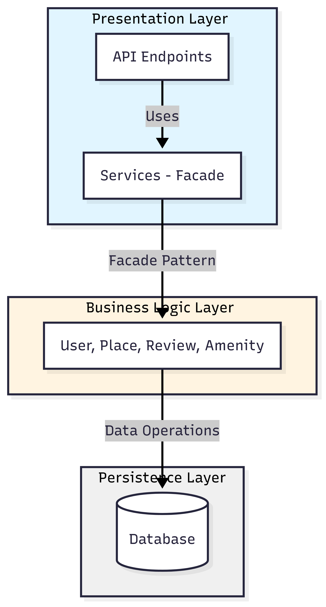
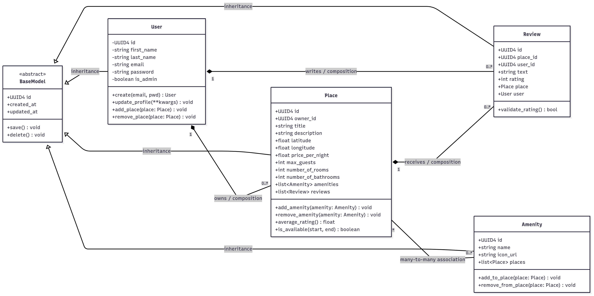

# UML Diagram

In this initial part of the project, we present UML diagrams and comprehensive technical documentation that will serve as the foundation for the development of the HBnB Evolution application. This documentation outlines the overall architecture, the detailed design of the business logic, and the interactions within the system.

## Package Diagram
For a clear understanding of the system's structure, we have divided the application into three main packages: Presentation Layer, Business Logic Layer, and Data Access Layer. Each package has specific responsibilities and interacts with others through well-defined interfaces.

  

### 1. Presentation Layer (services/API)

**Purpose:** Handles all user-facing interactions and external communication.

**Responsibilities:**

- Accept HTTP requests from clients
- Validate incoming data
- Delegate business operations to the Business Logic Layer via Facade
- Format and return responses to clients

### 2. Business Logic Layer (models/core logic)

**Purpose:** Contains the core functionality and business rules of the application.

**Responsibilities:**

- Implement business logic and rules
- Interact with the Data Access Layer to retrieve and manipulate data
- Perform data validation and processing
- Coordinate tasks between different models

### 3. Data Access Layer (Data access/storage)
**Purpose:** Manages data storage and retrieval.

**Responsibilities**:

- Abstract database access logic
- Execute CRUD (Create, Read, Update, Delete) operations
- Manage database connections and transactions
- Handle data mapping between objects and database tables
- Implement query logic and optimization

## Class Diagram
The class diagram illustrates the core domain models and their relationships within the Business Logic Layer

  

### BaseModel (Abstract)
The BaseModel serves as the foundation for all domain entities, providing common attributes and behaviors.

**Attributes:**

- `id` (UUID4): Unique identifier for each entity
- `created_at` (datetime): Timestamp of entity creation
- `updated_at` (datetime): Timestamp of last modification

**Methods:**

- `save()`: Persists the entity to the database
- `delete()`: Removes the entity from the database

### User
Represents a user in the system, who can be either a regular user or an administrator.

**Attributes:**

- `id` (UUID4): Unique user identifier
- `first_name` (string): User's first name
- `last_name` (string): User's last name
- `email` (string): User's email address (unique)
- `password` (string): Encrypted password
- `is_admin` (boolean): Administrative privileges flag

**Methods:**

- `create(email, pwd)`: Creates a new user account
- `update_profile(**kwargs)`: Updates user profile information
- `add_place(place)`: Associates a new place with the user
- `remove_place(place)`: Removes a place from the user's ownership

**Relationships:**

- Owns 0 or more Places (composition)
- Writes 0 or more Reviews (composition)

### Place
Represents a property listing that can be rented by users.
Attributes:

- `id` (UUID4): Unique place identifier
- `owner_id` (UUID4): Reference to the owning User
- `title` (string): Place name/title
- `description` (string): Detailed description
- `latitude` (float): Geographic latitude
- `longitude` (float): Geographic longitude
- `price_per_night` (float): Nightly rental price
- `max_guests` (int): Maximum guest capacity
- `number_of_rooms` (int): Number of rooms
- `number_of_bathrooms` (int): Number of bathrooms
- `amenities` (list): Associated amenities
- `reviews` (list): Reviews for this place

**Methods:**

- `add_amenity(amenity)`: Adds an amenity to the place
- `remove_amenity(amenity)`: Removes an amenity from the place
- `average_rating()`: Calculates the average rating from all reviews
- `is_available(start, end)`: Checks availability for given date range

**Relationships:**

- Owned by 1 User (composition)
- Receives 0 or more Reviews (composition)
- Has many-to-many relationship with Amenities

### Review
Represents a user's review and rating of a place.
Attributes:

- `id` (UUID4): Unique review identifier
- `place_id` (UUID4): Reference to the reviewed Place
- `user_id` (UUID4): Reference to the User who wrote the review
- `text` (string): Review content
- `rating` (int): Numeric rating value
- `place` (Place): Reference to the Place object
- `user` (User): Reference to the User object

**Methods:**

- `validate_rating()`: Ensures the rating is within valid range

**Relationships:**

- Written by 1 User (composition)
- Belongs to 1 Place (composition)

### Amenity
Represents features or services available at a place (e.g., WiFi, Pool, Parking).

**Attributes:**

- `id` (UUID4): Unique amenity identifier
- `name` (string): Amenity name
- `icon_url` (string): URL to the amenity icon
- `places` (list): Places that have this amenity

**Methods:**

- `add_to_place(place)`: Associates this amenity with a place
- `remove_from_place(place)`: Removes this amenity from a place

**Relationships:**

- Many-to-many relationship with Places